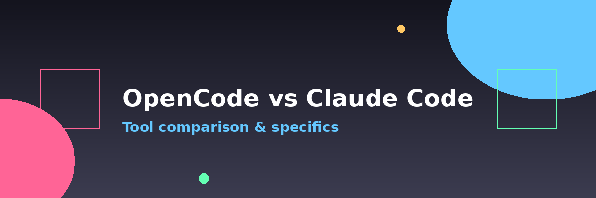

# OpenCode vs Claude Code



Both tools are agentic coding assistants that read context files, run shell commands, edit files, and integrate with git. They share the same core concepts — `AGENTS.md`, slash commands, MCP servers — so skills transfer directly between them.

---

## Side-by-side comparison

| Feature | OpenCode | Claude Code |
| --- | --- | --- |
| **Type** | Open-source TUI / VS Code extension | Anthropic's official CLI agent |
| **Models** | Any (OpenAI, Anthropic, Ollama, local) | Claude models (+ local via API shim) |
| **Context file** | `AGENTS.md` (primary) | `CLAUDE.md` (primary), also reads `AGENTS.md` |
| **Config dir** | `.opencode/` | `.claude/` |
| **Config file** | `opencode.json` | `.claude/settings.json` |
| **Slash commands** | `.opencode/commands/*.md` | `.claude/commands/*.md` |
| **Agents** | `.opencode/agents/*.md` | `.claude/agents/*.md` |
| **Skills** | `.opencode/skills/` (via plugin) | `.claude/skills/*/SKILL.md` |
| **MCP** | `opencode.json` → `mcp` key | `claude mcp add` / `.claude/mcp.json` |
| **Plan mode** | Built-in `plan` agent (read-only) | Shift+Tab twice |
| **Undo / rollback** | Git + session history | `/rewind`, checkpoints + git |
| **Parallel sessions** | Multiple terminal instances | `--worktree` flag, git worktrees |
| **IDE integration** | VS Code extension | VS Code extension + Terminal |
| **Cost** | Free (BYOM — bring your own model key) | Pay-per-use or Claude subscription |

---

## OpenCode specifics

OpenCode is model-agnostic. You bring your own API key for any provider — Anthropic, OpenAI, OpenRouter, or a local Ollama instance.

**Best for:**

- Working inside VS Code with tight editor integration
- Using local models (Ollama, LM Studio) for privacy or cost
- Teams or individuals who want to switch models freely
- Open-source workflows

**Configuration:**

```json
// opencode.json (project root or ~/.config/opencode/)
{
  "$schema": "https://opencode.ai/config.json",
  "model": "anthropic/claude-sonnet-4-5",
  "provider": {
    "anthropic": {}
  }
}
```

**Key OpenCode features:**

- **Zen models:** OpenCode maintains a curated list of models tested to work well with agentic coding. Use `/connect` → `OpenCode Zen` to access them without managing multiple API keys.
- **Plugins:** extend OpenCode via npm packages (e.g., `opencode-ignore` to block sensitive file reads).
- **VS Code integration:** run directly from the VS Code terminal; file changes appear live in the editor.
- **System prompt:** customize global AI behavior in `~/.config/opencode/system_prompt.md`.

**Tips:**

- Set `numCtx: 32768` or higher for local Ollama models — vibe coding needs large context.
- Use the `plan` agent before the `build` agent for complex features.
- The `/push` command (custom) is a good first slash command to create.

---

## Claude Code specifics

Claude Code is Anthropic's official CLI agent, optimized for Claude models. It has deeper integration with Claude's capabilities — long reasoning, multi-step planning, and web search.

**Best for:**

- Complex architecture decisions and long reasoning chains
- Projects where you want the most capable model available
- Teams using GitHub Copilot or GitLab Duo (zero-setup subscription use)
- Workflows that benefit from Claude's built-in skills and hooks system

**Setup:**

```bash
npm install -g @anthropic-ai/claude-code
claude
/connect  # select provider and enter API key
```

**Key Claude Code features:**

- **Plan mode:** Shift+Tab twice. The agent cannot write files until you approve the plan. This is the most effective way to catch misunderstandings before they become code.
- **Checkpoints:** `/rewind` restores a previous state. Works within a session — complements git for in-session undo.
- **Skills:** folder-based bundles of prompts + scripts in `.claude/skills/*/SKILL.md`. Powerful for repeatable domain-specific tasks (e.g., PDF processing, database migrations).
- **Hooks:** automate actions on events — run lint after every file edit, play a sound when the agent finishes.
- **Subscription models:** use existing GitHub Copilot or GitLab Duo subscriptions with zero additional cost.

**Tips:**

- `/clear` aggressively — Claude Code's context fills fast on complex tasks.
- Use subagents for investigation: `"Use a subagent to explore the auth system"` keeps the main context clean.
- Create a `CLAUDE.local.md` for personal instructions (never commit — it's auto-gitignored).
- `CLAUDE.md` and `AGENTS.md` are both read — you can use either name.

---

## Running both tools on the same project

This is a valid workflow. They read the same `AGENTS.md`, respect the same `.gitignore`, and write to the same files.

Use whichever tool fits the task:

- OpenCode for quick iterations and local model usage.
- Claude Code for complex reasoning, long planning sessions, or when you want Plan mode.

The key is keeping `AGENTS.md` accurate — both tools depend on it equally.

---

← [Previous: Workflow](04-workflow.md) | [Next: Resources →](06-resources.md)
